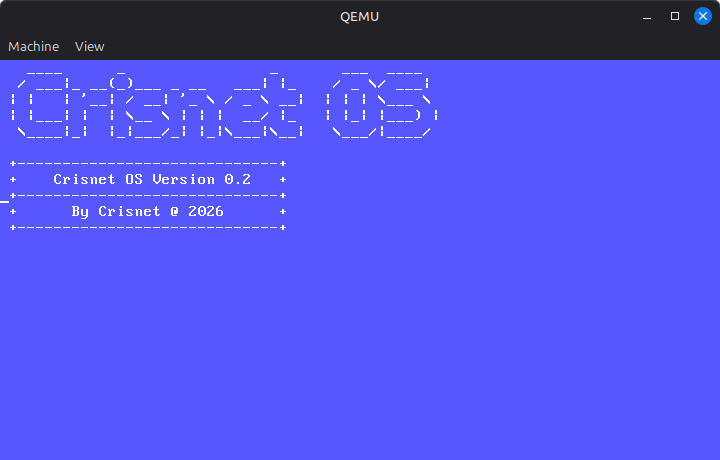

# Crisnet OS

A basic Operating System **64-bit**, just the kernel, that prints text directly to the **VGA**.

## Made with Rust 🦀 and NASM

## Requirements

- NASM
- Rust/rustc
- `x86_64-unknown-none` Rust target
- GNU `ld` and `objcopy`
- QEMU X86_64

Install the target:

    rustup target add x86_64-unknown-none

Build:

    chmod +x build.sh
    ./build.sh

Run:

    qemu-system-x86_64 -drive format=raw,file=build/crisnet-os.img
